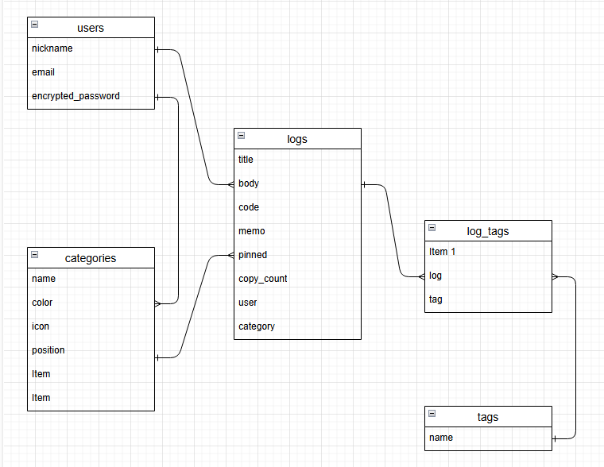
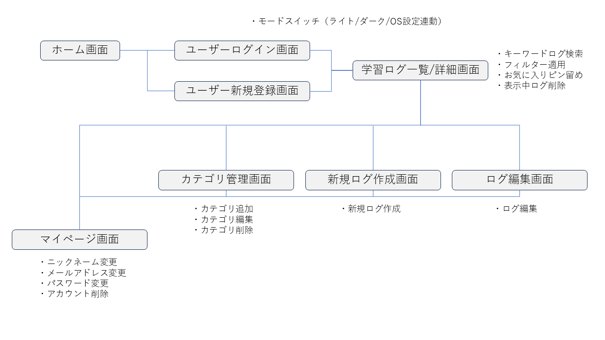

## アプリケーション名
Re:Search -知識を、再発見する-

## アプリケーション概要
学習した内容や調べた内容をカテゴリ・タグで整理して記録し、本文やコード、画像を保存・再利用できるナレッジ蓄積・活用アプリ。

## URL
https://research-log.onrender.com/

## テスト用アカウント
メールアドレス：test@test.co.jp
パスワード：test2025
Basic認証
ID：admin_user
PASS：20191224

## 利用方法
- ログイン後、最初に「カテゴリ管理」から任意のカテゴリを入力して追加する。
- ログ一覧から「新規ログ作成」でタイトル・カテゴリ・タグ・本文・コード・画像・ひとことメモなどを入力して保存する。
- ログ一覧で検索／絞り込みを行い詳細を確認する。「Copy」ボタンでコード例をクリップボードにコピー可能。
- 必要に応じてログを編集・削除する。

## アプリケーションを作成した背景
様々な学習者が自身の学んだ知識を蓄積し、検索してすぐに使える形（クリップボードへのコピー）で取り出せるようにするため

## 実装した機能についての画像やGIFおよびその説明

## 実装予定の機能
- CSV / Excel インポート・エクスポート機能
- AI検索（自然文 → 関連ログの組み合わせ提示やコード生成）
- AIによるコード リファクタリング
- 類似コードのレコメンド機能　
- チーム共有（ロール・権限）

## データベース設計
projects\research_log\ER.dio

## 画面遷移図
projects\research_log\ScreenTransition.png

## 開発環境
- Ruby on Rails
- Ruby
- JavaScript (Importmap)
- PostgreSQL(Render)
- MySQL(local)

## ローカルでの動作方法
- git clone ＜リポジトリURL＞
- cd research_log
- bundle install
- rails db:create
- rails db:migrate
- rails s

## 工夫したポイント
- ログインしてすぐに検索・呼び出し・コピペができ現場で活用できること
- スクリーンショットを Ctrl + V  / Cmd + V 貼り付けで画像登録できる
- 長時間使用しても目にやさしいダークモードへいつでも切替可能

## 改善点

## 制作時間

